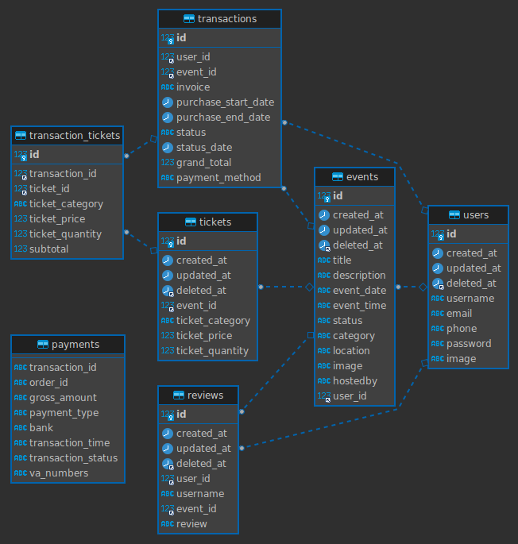

# RESTful API : Event Booking App

  

    Group Project 3 Unit 2 Alterra Academy
     
    <a href="https://app.swaggerhub.com/apis/dimasyudhana/EventappRESTfulAPI/1.0.1#/"><strong>| Open API Documentation |</
     
     
  

 

     
    <a href="https://event-planning-phi.vercel.app/"><strong>| Open API Documentation |</
    <a href="https://event-planning-phi.vercel.app/"><strong>| User Interface |</strong></a>
     
  

## About the Project

RESTful API : Event Booking App is a web application-based online market place for selling event ticket. Users can also discuss with other users about the event to be held. Here you can sell paid or free tickets. We implement midtrans for payment gateway

### 🔗 Entities Relational Database

  

## Technology Stack

### Framework

- [Echo (Go web framework)](https://echo.labstack.com)

### Package

- [Gorm (ORM library)](https://gorm.io)
- [Midtrans (Payment gateway)](https://www.midtrans.co)
- [Google Cloud Storage (Image uploader)](https://cloud.google.com/storage)

### Database

- [MySQL (Open source database)](https://www.mysql.com)

### Deployment

- [Cloud Computing - Amazon Web Services (Cloud Server)](https://aws.amazon.com/)
- [Docker (Container images)](https://www.docker.com)

## Contact
- [FE - Azhari Aziz](https://github.com/Azhari12) (developer and maintainer)
- [BE - Dimas Yudhana](https://github.com/dimasyudhana) (developer and maintainer)
- [BE - Wanta Zulfikri](https://github.com/wanta-zulfikri) (person in charge and maintainer server)

(<a href="#top">back to top</a>)

